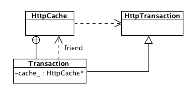

# 内部类 (Inner Class)
##目的
* 不用通过多重继承就可以实现多套接口,同时可以自然地向上转换(Up-casting)。
* 在单个抽象下提供相同接口的多个实现。


##别名


##动机
两个独立类库通过不同的接口提供的虚函数签名可能冲突，如果这时需要同时实现这两个函数就会出现问题。示例如下:
```
class Base1  /// 来自月球
{
  public:
      virtual int open (int) = 0;
      /* virtual */ ~Base1() {}  // 不允许多态的析构函数
};

class Base2  /// 来自木星
{
  public:
      virtual int open (int) = 0;
      /* virtual */ ~Base2() {}  // 不允许多态的析构函数
};

class Derived : public Base1, public Base2
{
  public:
    virtual int open (int i)
    {
      // Wow! 到底来自哪里?
      return 0;
    }
    /* virtual */ ~Derived () {}
};
```
内部类惯用法就是用来解决这个问题。

##解决方案及示例
仍然是上面的例子，两个基类不用修改，改用如下方式实现子类:
```
#include <iostream>
class Base1  /// 来自月球
{
  public:
      virtual int open (int) = 0;
      /* virtual */ ~Base1() {}  // 不允许多态的析构函数
};

class Base2  /// 来自木星
{
  public:
      virtual int open (int) = 0;
      /* virtual */ ~Base2() {}  // 不允许多态的析构函数
};

class Derived  // 注意没有继承
{
  class Base1_Impl;
  friend class Base1_Impl;  // 注意声明友元
  class Base1_Impl : public Base1  // 注意是公共继承
  {
   public:
    Base1_Impl(Derived* p) : parent_(p) {}
    int open() override { return parent_->base1_open(); }

   private:
    Derived* parent_;
  } base1_obj;  // 注意成员变量.

  class Base2_Impl;
  friend class Base2_Impl;  // 注意声明友元
  class Base2_Impl : public Base2  // 公共继承
                     {
   public:
    Base2_Impl(Derived* p) : parent_(p) {}
    int open() override { return parent_->base2_open(); }

   private:
    Derived* parent_;
  } base2_obj;  // 成员变量

  int base1_open() { return 111; }  /// 实现
  int base2_open() { return 222; }  /// 实现

 public:

  Derived() : base1_obj(this), base2_obj(this) {}

  operator Base1&() { return base1_obj; }  /// 转到Base1&
  operator Base2&() { return base2_obj; }  /// 转到Base2&

}; /// class Derived

int base1_open(Base1& b1) { return b1.open(); }

int base2_open(Base2& b2) { return b2.open(); }

int main(void) {
  Derived d;
  std::cout << base1_open(d) << std::endl;  // Like upcasting in inheritance.
  std::cout << base2_open(d) << std::endl;  // Like upcasting in inheritance.
}
```
附个类图便于理解:


这里的类Derived并不是子类，而是通过内部的两个嵌套类实现不同的接口，再桥接回到自己定义的两个实现的函数： base1_open及base2_open。两个嵌套类不会共享继随关系，通过Derived类提供的两个转换操作符可以实现Derived转换到任意的基类。另外两个内部类对象也免去了额外的生命周期管理，它们的生命周期与Derived对象一致。

##已知的应用
**译注:**
Inner Class的概念来自于Java, 其本特征是嵌套类通过友元的方式可以使用外部类的私有成员变量和成员函数，从而支持更强的交互。而且通常这个内部类需要是私有的。
以Chromium网络模块的Http Cache为例:


这是一个简单的例子，并没有多重继承。更多的是强调了封装和信息隐藏(HttpCache::Transaction是HttpCache内私有的类)的OO特性。

##相关的惯用法
* Interface Class
* Capability Query

##参考
* Thinking in C++ Vol 2 - Practical Programming --- by Bruce Eckel.

